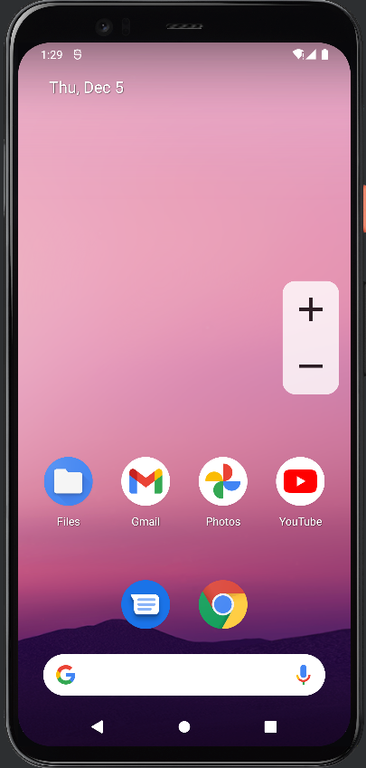

# Floating Volume App

A simple Android app that creates floating buttons for adjusting the device's volume. The buttons can be dragged vertically on the screen.

---

## Features
- **Floating Buttons**: "+" to increase and "-" to decrease the volume.
- **Vertical Dragging**: Buttons can be moved up and down but remain fixed horizontally.
- **Continuous Volume Adjustment**: Holding the buttons continuously adjusts the volume.
- **Volume Bar Display**: Displays the system volume bar during adjustments.

---




---

## Download

[From Repo](release/FloatingVolume.apk)
 or 
[from Releases]([release/FloatingVolume.apk](https://github.com/BrunooDosAnjos/FloatingVolume/releases))

---

## How to Use
1. Launch the app.
2. Grant the "Draw Over Other Apps" permission when prompted.
3. Use the "+" and "-" buttons to adjust the volume.
4. Drag the buttons vertically to reposition them on the screen.

---

## Permissions
- **`SYSTEM_ALERT_WINDOW`**: Required to display floating buttons over other apps.

---

## Technologies
- **Language**: Java
- **Framework**: Android SDK
- **Minimum SDK**: API 23 (Android 6.0)

---

## Project Structure
```plaintext
src/
├── MainActivity.java
├── FloatingButtonService.java
res/
├── layout/
│   ├── floating_buttons.xml
├── drawable/
│   ├── ic_add.xml
│   ├── ic_remove.xml
```

## Customization
- Adjust the transparency, size, or position of the buttons by modifying the floating_buttons.xml or FloatingButtonService.java.

---

**Feel free to contribute or suggest improvements! 🚀**


